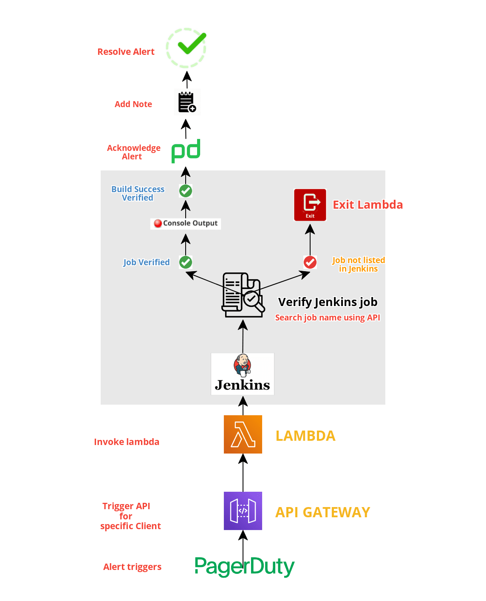

# Check Jenkins job alerts and automate the incident actions

### Author: Ashish Mathai
###### Code Version: V2
### Topic: 
We get alerts on daily basis and the jobs are successful and its getting     failed due to old Jenkins and plugin issue. Permanent fix, Upgrade Jenkins and plugin

###  Update:
v2: Add SSM for credentials instead of passing clear text

### Use case
Oncall team gets daily alerts on Jenkins job failure from Client, basically job build successfully and due to old jenkins version (1.474) and plugin compatibility issue the build finishes with failure.
As this is a repetivie alert and only action for oncall is to copy the build success and post the note and resolve the alert.

### Automation
We can automate this by using python to acknowledege the alert, add note and resolve it
##### Conditions
- When alert triggers, python invokes and check the Jenkins Jobs and verifies the jobs console output
- Use regex to match the patterns for build success
- If build is successful then it will Acknowlegde the alert
- Further get the build success output from console and add the notes in Pagerduty
- Resolve the alert

##### What we are acheiving from this?
Normally we get 25 Jenkins failure alert on daily basis comparing all 3 shifts.
For a minimum time, if we compare to check each alert takes 2-3 mins
- if spending 2 mins per alert, saves 50 mins for the team
- if spending 3 mins per alert, saves 75 mins for the team

### Setup 

- API Gateway (POST) integrated with Pagerduty
- PD -> Serivce -> ingration -> Generic webhook -> API Gateway
- Get events from PD on (λ) Lambda to process
- Filter services and check Shift time to process further

#### Included
- Shift time check
- Time in PST
- Custom checks for couple of Builds which are not getting verified using Jenkins API

### Plugins
Instructions on how to use them in your own application are linked below.

| Plugin | README |
| ------ | ------ |
| Requests | [pip3 install reuqtests][l1] |
| Json | [pip3 installl json][l2] |
| Re | [pip3 install re][l3] |
| urllib3 | [pip3 install urllib3][l4] |
| Time | [pip3 install time][l5] |
| Jenkins | [pip3 install python-jenkins][l6] |

### License
**nClouds**

   [l1]: <https://pypi.org/project/requests/>
   [l2]: <https://pypi.org/project/jsons/>
   [l3]: <https://pypi.org/project/regex/>
   [l4]: <https://pypi.org/project/urllib3/>
   [l5]: <https://pypi.org/project/time/>
   [l6]: <https://pypi.org/project/python-jenkins/>